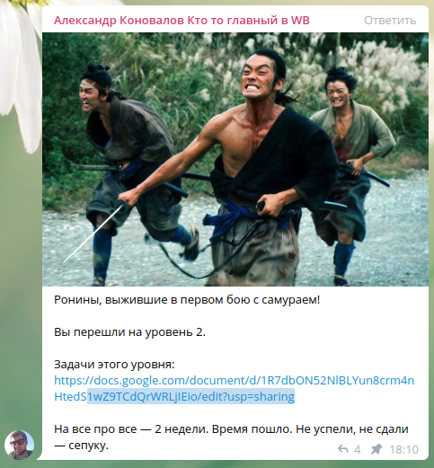

# Второй уровень

## Паттерны

1. - фасад
2. - строитель
3. - посетитель
4. - комманда
5. - цепочка вызова
6. - фабричный метод
7. - стратегия
8. - состояние

## Чтение и понимание кода

1. read +
2. read +
3. read +
4. read +
5. read +
6. read +
7. read +

## Задачи на разработку

1. dev +
2. dev +
3. dev +
4. dev +
5. dev +
6. dev +
7. dev +
8. dev -
9. dev +
10. dev -
11. dev -
